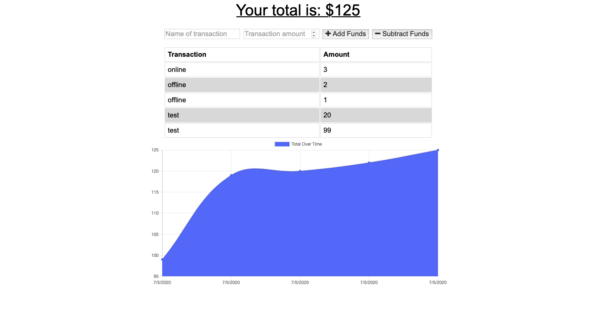

# Budget-Trackers

- [About](#about)
- [User Story](#user_story)
- [Link](#link)
- [Screenshot](#screenshot)
- [License](#license)

## About
This application is an exercise to use Service Worker and IndexedDB. User can use this Budget Tracker App without an internet connection. When the user inputs a withdrawal or deposit, then that will be shown on the page, and added to their trasaction history when their connection is back online. 

## User_Story

* AS AN avid traveller
I WANT to be able to track my withdrawals and deposits with or without a data/internet connection
SO THAT my account balance is accurate when I am traveling

## Link
[Budget Tracker](https://protected-spire-05676.herokuapp.com)

## Screenshot

## License

[MIT License](LICENSE)